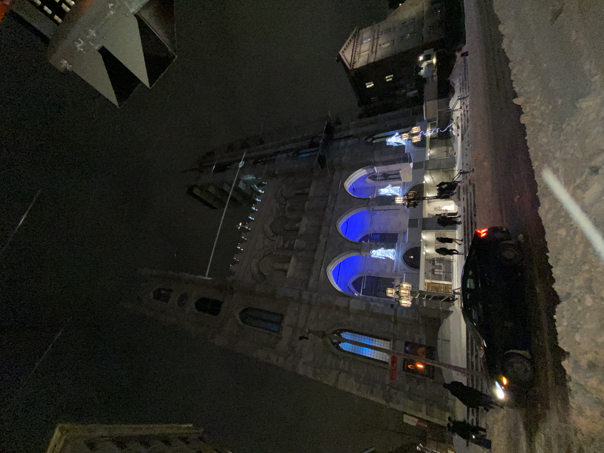
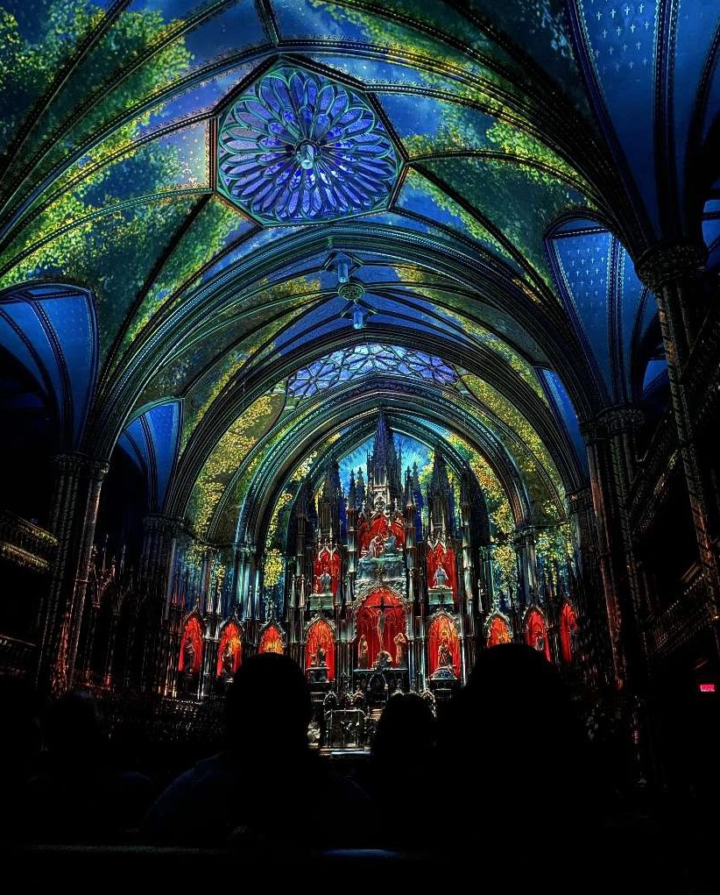
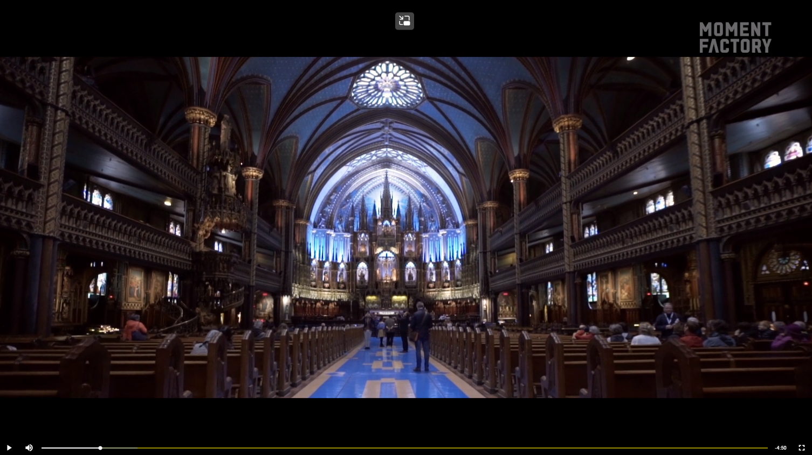

# Aura 
## Tarik Mikou (directeur de création)/ Moment factory
 - Année de réalisation: 2017
 - À la basilique Notre-Dame
 - visité le 25 février 2022 à 20h
 - Oeuvre récipiendaire du prix THEA Outstanding achievement (2018), Design APPLIED ARTS (2018), NUMIX Video Mapping (2018)

La Fabrique de la Paroisse Notre-Dame a demandé à Moment Factory de concevoir une expérience permanente en son, lumière et vidéo qui attirerait les visiteurs et leur permettrait de découvrir autrement la basilique Notre-Dame, dans le Vieux-Montréal.

Notre défi était de créer un spectacle universel, qui captive, touche et inspire les visiteurs de toutes confessions, mette en valeur ses œuvres et son architecture et respecte le patrimoine religieux de la basilique. D’un point de vue technique, jamais nous n’avions projeté sur une surface aussi vaste et complexe. Le canevas étant composé de multiples couleurs, le mapping vidéo imposait un ajustement pixel par pixel.

L’expérience AURA débute par un parcours d’installations multimédias qui mettent en valeur certaines oeuvres de la basilique. Cette période de découverte invite le visiteur à explorer les richesses de la basilique, à son rythme et s’immerger dans son univers.

Lumière, musique orchestrale originale et architecture grandiose se rencontrent ensuite pour offrir un spectacle multimédia dont l’énergie envoûtante emmène le spectateur du plancher à la voûte, jusqu’au plus profond de lui-même.

la description de l'oeuvre provient du [site web de Moment Factory](https://momentfactory.com/projets/tous/tous/aura)

Aura est une oeuvre immersive de grande ampleur. Elle est situé dans la basilique Notre-dame et est projetée sur les parois intérieur de la basilique. À aucun moment on peut voir les composants techniques et nécessaire à la mise en exposition.
 
### Recherche pré-visite de l'oeuvre
puisque Moment Factory est une firme bien établei dans le domaine du multimédia, il ont fait un super travaille de documentation pendant leur pré-production. J'ai trouvé plusieur vidéo de documentation sur leur site web qui expliquais leur processus de création. Ils on fait appel a plusieur type d'artiste pour arriver à leur fin. Par example, ils ont fait appel à une orchestre pour enregistrer des bandes-sons pour l'expérience. Ils ont aussi du faire appel à des artiste 3D pour crée toutes les animations qui ont ensuite du être mapper piexels par pixels à cause de la complexiter de l'architeture à l'intérieure de la basilique Notre-Dame.

### Liste des composants technique de l'oeuvre
  - Plusieur haut-parleur
  - Plusier dizaines de projecteurs
  - ordinateur de controle
  - des milliers de fils audio
  - des milliers de fils dpour l'envoi du flux dans les projecteurs

### Liste des éléments nécessaires à la mise en exposition
  - L'architecture de la basilique Notre-Dame

### EXPERIENCE VÉCU :
  - L'expérience est difficile à expliquer, car je n'ai pas d'autre référence pour d'écrire cet expérience. Premièrement, en arrivant à la basilique c'est un batiment impresionnant et imposant. Ensuite, en entrant il y avait une musique d'ambiance qui apportait un peu de suspense. Ensuite, quand le spectacle commence il y avait une espèce de fréquence basse qui commencais à nous englober et d'un moment les projections ont commencer. J'ai trouver que la durée du spectacle étais bien, car il n'étais pas trop court au point ou tu en voudrais plus, mais juste asser long pour que tu est eu ce que tu voulais en tant qu'auditeur. Un autre point est que même si il n'y a pas de narration vocale, l'expériecne à une sorte de linéariter et histoire qui guide l'auditeur. ce que je veux dire c'est que a certain moment c,étais plus calme et a d'autre moment la musique s'accéllèrasi et s'amplifais et le visuel aussi.  
  - Ce qui m'a plu de cette oeuvre c'est la grandeur du lieu dans lequel ça se déroule. La basilique est un lieu avec de l'histoire et l'achitecture à l'interieur te le rapelle. J'ai aussi adoré l'acoustique de la basilique. Le fait que ce soit très grand venait amplifer le son et faisait trambler les bancs. J'ai aussi adorer le fait que nous étions au centre de l'oeuvre et peut importe ou tu regardais il y avait quelque chose qui se passe. Je crois que si un jour je peux travailler sur un projet avec un aussi gros budget que Moment factory avait pour ce projet se serait de pouvoir faire une oeuvre dans un lieu comme celuui-ci, je trouve etrêmement pertinant de redonner vie à un lieu comme celui-ci. 
  - ASPECT QUE VOUS NE SOUHAITERIEZ PAS RETENIR POUR VOS PROPRES CRÉATIONS OU QUE VOUS FERIEZ AUTREMENT ET JUSTIFICATIONS
  - Honnêtement, trouver un point négatif  à Aura est difficile, car c'est une réalisation de très grand ampleur comme j'ai dit plutos c'est un création de Moment Factory et  ils ont accès a plein de ressources pour arriver à leur fin.

### RÉFERENCES
[site web de Aura](https://www.aurabasiliquemontreal.com/fr)
[site web de moment factory](https://momentfactory.com/projets/tous/tous/aura)
