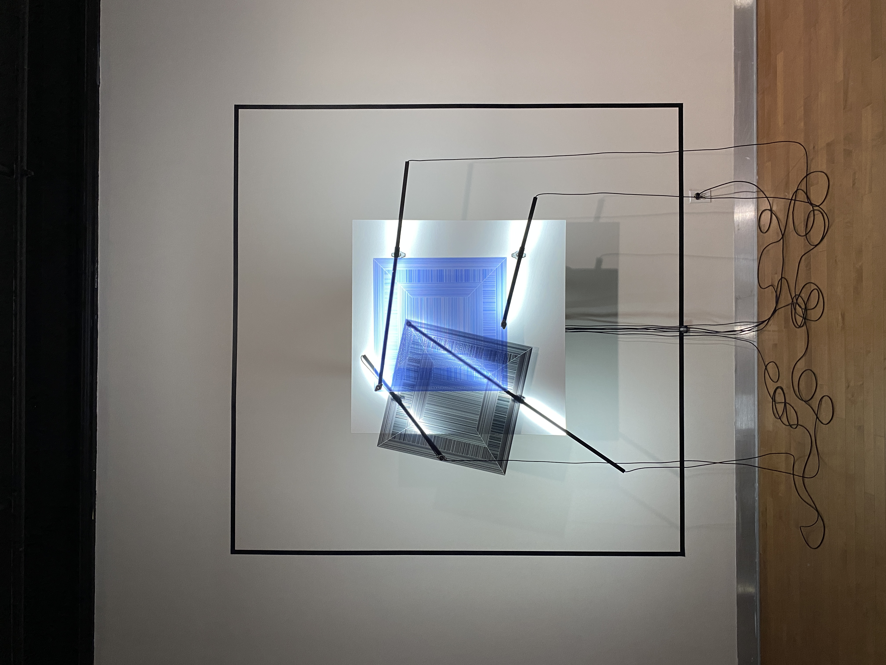
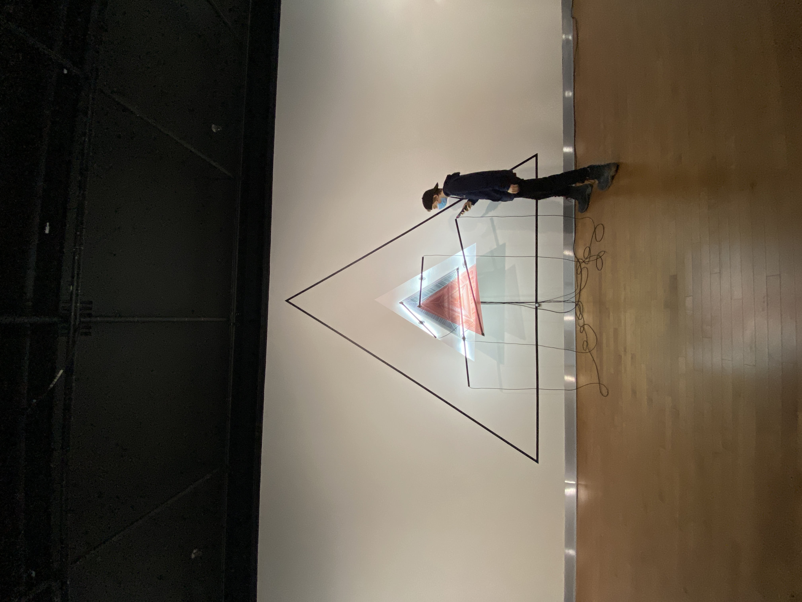
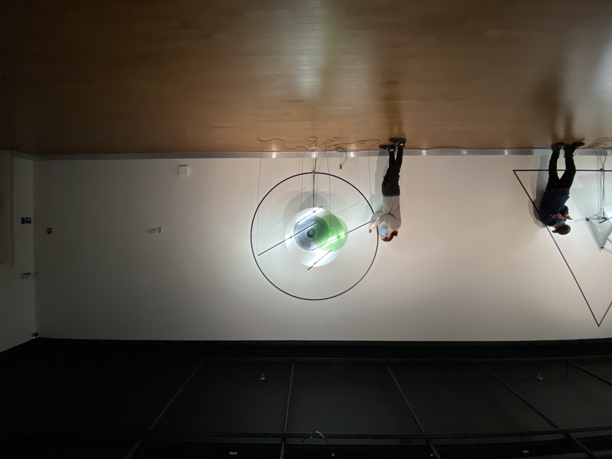
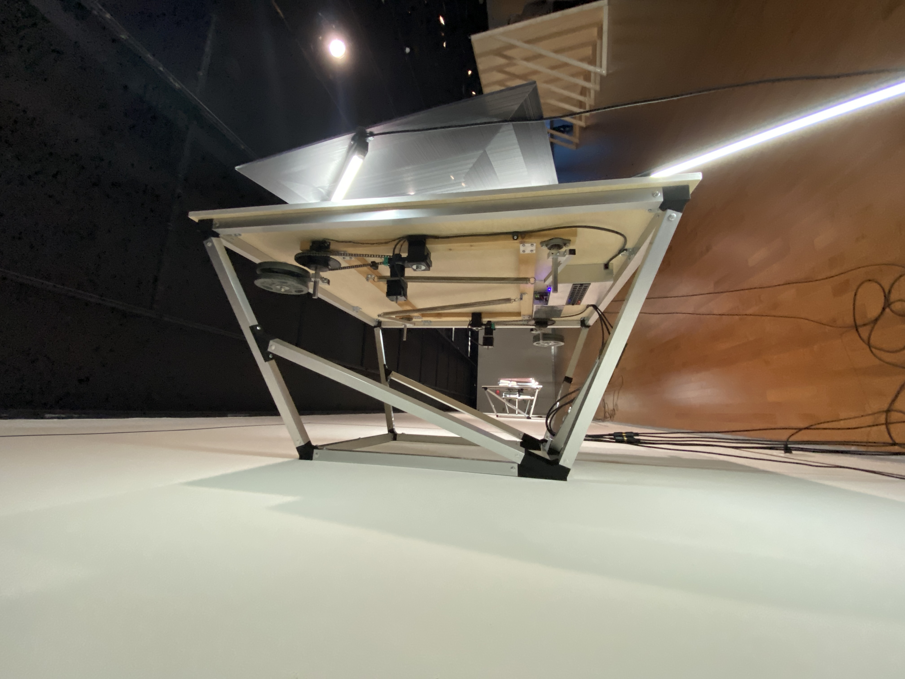
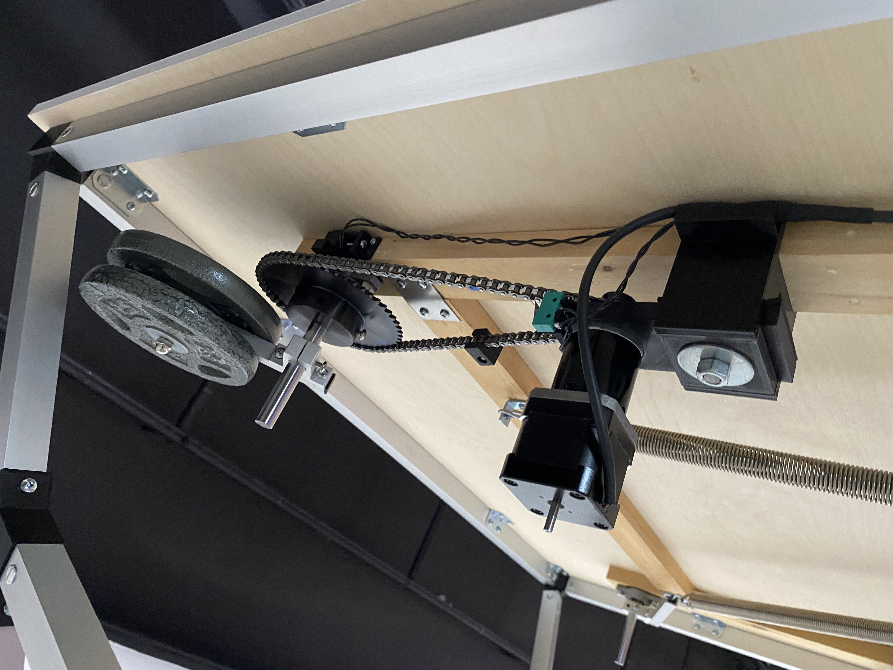
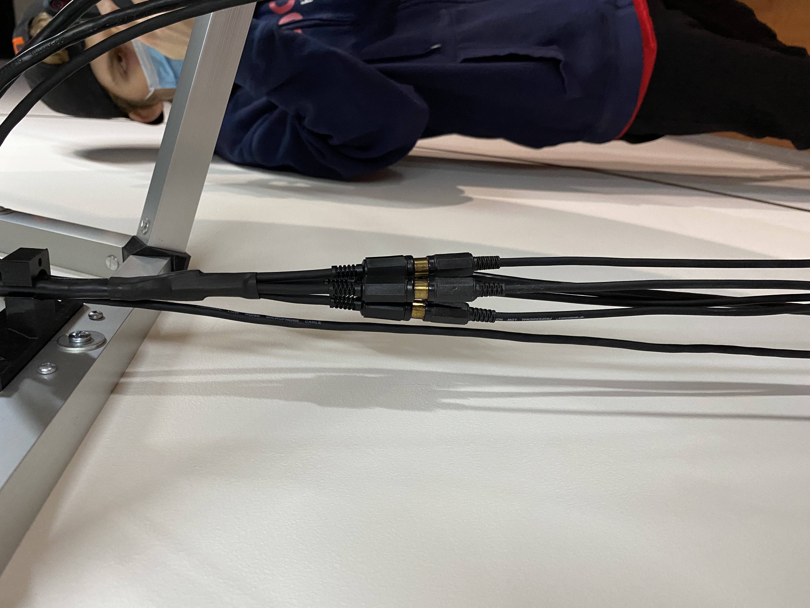
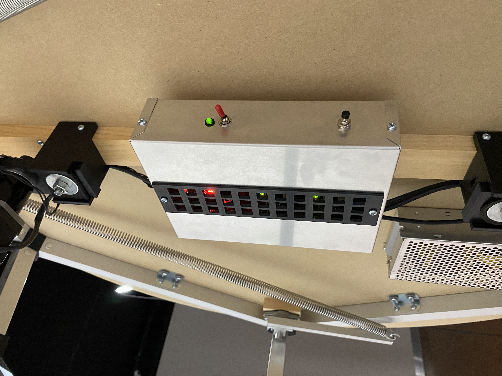
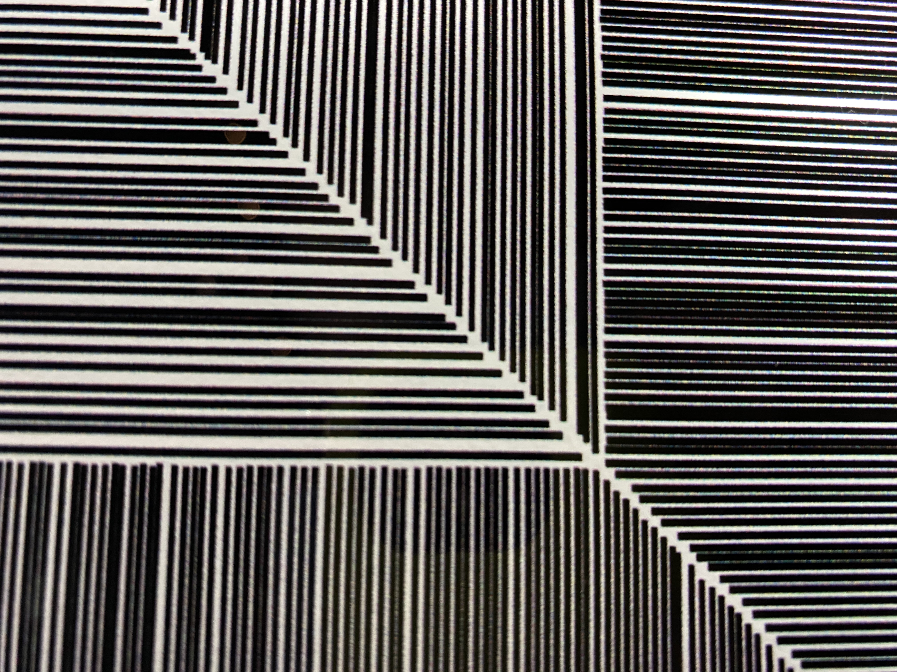

# Configuration du sensible
## Catherine Béchard et Sabin hudon
 - Exposition réalisée en 2022
 - Situé à la salle Alfred Pellan de la Maison des arts de Laval
 - Date de visite: 16 mars 2022 de 15h15-16h15

L'exposition Configuration du sensible est composé de trois oeuvres. Premièrement, L'en deçà (2021), ensuite la projection vidéo Le fleuve (2021) et finalement l'oeuvre Méchanisme de dessaisissement (2019-2021). Il est  important de spécifier que ces trois oeuvre étais placé de sorte à ce que le visiteur suivre un trajet spécifique qui permet de garder la cohérence du propos artistique des deux artistes. Chaqune de ces oeuvres appellaient différents sense et se complettaient. La première oeuvre etais une oeuvre auditive a prime abord, mais pouvait se transformer en expérience sensorielle. La deuxième oeuvre étais une oeuvre audio-visuelle qui représentais les mouvements de l'eau. La derniere oeuvre etais une sculpture composé de moteurs et elle créait des illusions d'optiques.  

## L'en deçà (2021)

## Liste des composantes techniques de l'oeuvre
 - transducteurs
 - ordinateur de controle
 - carte de son Focusrite
 - fils de courants et fils pour les transducteurs
 - structure en bois

### tansducteur
 
### ordinateur de controle  
 
### carte de son  
 
### fils pour le courant et les transducteurs  
 
### Structure en bois  
 

## Liste des éléments nécessaires à la mise en exposition 
  - cache fils
  - projecteurs de lumière
  - grand espace pour acceuillir la structure de bois imposante
### cache fils 

### Espace, tels que la salle Alfred Pellan, asser grand pour la structure de bois

## Le fleuve (2021)

### Liste des composantes techniques de l'oeuvre 
  - projecteur
  - hauts-parleurs

### Liste des éléments nécessaires à la mise en exposition  
  - mur pour la projection
 
 
 video de l'oeuvre 

## Méchanisme de dessaisissement (2019-2021)

### oeuvre carré

### oeuvre triangulaire

### oeuvre circulaire

### Liste des composantes techniques de l'oeuvre
  
  - structure en métal
  - moteur
  - chaine
  - ressort
  - cable d'alimentation
  - planche de bois
  - poids d'entrainement
  - ordinateur de controle
  - lumiere del
  - feuille d'acrylique

### Liste des éléments nécessaires à la mise en exposition  
  - lumiere au plafond pour illuminer l'oeuvre
  - ruban adhesif noir sur le mur
  - prise de courant
  - mur qui peut supporter la structure
  
   
   
   
   
   
   
   

### EXPERIENCE VÉCU :
  - Cette exposition est plutot contenplative, les deux derniere oeuvre son a observer et elles ne demendent pas à interagire avec celle-ci. Tandis que la première quand à elle peut être experimenté physiquement, car le son est conduit par des transducteurs et non des hauts-parleurs donc nous pouvions toucher au mur pour ressentir en quelques sorte les son qui se propagaient a l'aide des transducteurs et des planches de bois. De plus, j'ai trouver très intéressant la façon dont le parcour etais tracé ou nous commencions par une oeuvre sonore ensuite directement en sortant de la structure nous appercevions la projection et finalement les sculptures sur le mur. 
  - Ce qui ma plu de cette exposition c'est la façon dont les artiste ont approché la façon de nous faire vivre le son. Personellement je suis passionné de son et de la façon dont on peut le manipuler, le transformer et en faire ce que le veut pour transmettre une emotion ou installer un ambiance. Dans l'oeuvre L'en deçà le son ne sortait pas par des hauts-parleurs mais des planche de bois, je trouve que il y a quelque chose de très interresant, car cela permet de cahnger l'accoustique du son a la source de ou il sort et je pourrait me voir utiliser une technique comme cell-ci dans un de mes projets futures en multimédia.
  - L'aspet qui m'a le plsu déplu est la projection vidéo. J'avasi l'impression que le format me dérangeait, j'aurais préférer une projection qui recouvre le mur au complet et non un e petite partie seulement. Je trouve que cela brisait l'idée de grandeur qu'on retrouvais dans l'oeuvre L'en deçà.

### RÉFERENCES
[Site web de l'exposition](https://bechardhudon.com/project/configurations-du-sensible-2022/)
