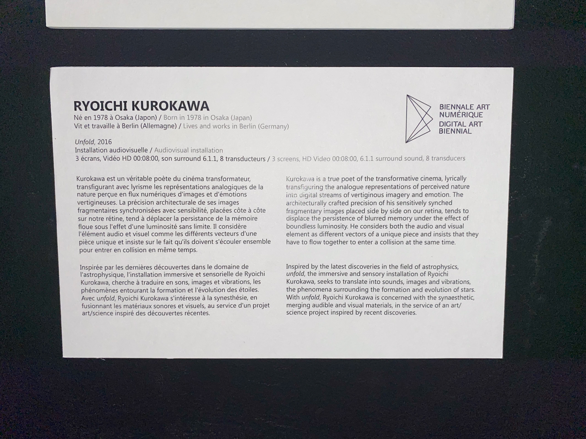

# Unfold
## Ryoichi Kurokawa
 - 2016
 - ELEKTRA : 5e Biennale internationale d'art numérique (BIAN)
 - Arsenal Art contemporain Montréal
 - 9 février 2022

Inspirée par les dernières découvertes dans le domaine de
l'astrophysique, l'installation immersive et sensorielle de Ryoichi
Kurokawa, cherche à traduire en sons, images et vibrations, les
phénomènes entourant la formation et l'évolution des étoiles.
Avec unfold, Ryoichi Kurokawa s'intéresse à la synesthésie, en
fusionnant les matériaux sonores et visuels, au service d'un projet
art/science inspiré des découvertes récentes. Ceci est tiré du cartel de l'oeuvre inséré ci-dessou.

Unfold ce situe au milieu de la pièce. Cette oeuvre mesure environ 5 mêtres de haut, donc elle saute aux yeux quand on entre dans la BIAN. Composé de trois écrans bout à bout avec un lèger angle permettant de créer un effet de grandeur pour l'utilisateur.

### LISTE DES COMPOSANTES TECHNIQUES DE L'OEUVRE
  - 3 projecteurs
  - 3 écrans
  - système de son surround 6.1.1 (c'est-à-dire 6 hauts parleurs autour de l'utilisateur pour lui permetre  d'entendre si les sons proviennet de la gauche, la droite, l'avant ou l'arrière. Ensuite le premier 1 signifie qu'il il y a un caisson de basses et le dernier 1 signifie qu'il y a un speaker au niveau du plafond orioenté vers l'utilisateur pour permettre à l'utilisater de percevoir les snos sur l'axe des Y aussi don si le son provien non seulement du le gauche, mais s'il provient de la gauche en haut ou la gauche en bas.)
  - 8 transducteurs (les dispositif qui permettent de créer les vibrations)
  - ordinateur de controle
  - panneau de son 
  - cables de xlr pour envoyer le son dans les hauts parleurs
  - cables de flux vidéo pour transmettre le flux vidéo au projecteurs
  - 

### LISTE ÉLÉMENTS NÉCESSAIRES MISE EN EXPOSITION 
  - structure pur suspendre au plafond
  - Cables de suspension au plafond pour retenir les écrans
  - Pied pour tenir les hauts parleurs
  - structure en bois pour cacher les transducteurs et permetre a l'utilisateur de se tenir dessu
  - chemin de protection pour les files au sol
  - 

### EXPERIENCE VÉCU :
  - (DESCRIPTION EXPÉRIENCE, GESTE À POSER...)Unfold Est une oeuvre immersive et contemplative c'est à dire qu'on n'a pas de geste à poser pour intéragir avec l'oeuvre. D'abord, en arrivant dans la salle de la BIAN, l'oeuvre de Ryoichi Kurokawa est la première qui a capté mon attention à cause de son emplacement et Unfold est une oeuvre imposante. 
  - (CE QUI VOUS A PLUS, DONNÉ DES IDÉES ET JUSTIFICATION) 
  - ASPECT QUE VOUS NE SOUHAITERIEZ PAS RETENIR POUR VOS PROPRES CRÉATIONS OU QUE VOUS FERIEZ AUTREMENT ET JUSTIFICATIONS

### RÉFERENCES
https://vimeo.com/159521082
http://www.ryoichikurokawa.com/project/unfold.html
https://www.elektramontreal.ca/bian2021-ryoichi-kurokawa?lang=fr

